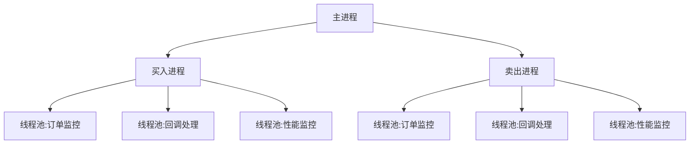

# QMT量化交易实盘框架

[](https://www.python.org/downloads/)
[](LICENSE)
[](https://github.com/astral-sh/uv)

基于xtquant的高性能量化交易框架，专为QMT(Quantitative Market Trading)设计，提供多进程多线程的实盘交易解决方案。

## ✨ 核心特性

- 🚀 **高性能架构**：多进程独立运行买入/卖出策略，线程池管理订单执行
- 📊 **实时行情处理**：全市场行情订阅与高效数据处理
- 🛡️ **智能风控系统**：持仓监控、订单限制、异常处理
- 📈 **策略开发友好**：清晰的策略接口，快速实现交易逻辑
- 📝 **完善日志系统**：详细记录交易过程，便于复盘分析

## 📦 安装

使用uv包管理器安装依赖：

```bash
uv add xtquant
```

## ⚙️ 配置

1. 复制示例配置文件：

```bash
cp core/config.example.py core/config.py
```

2. 编辑`core/config.py`配置您的交易账号和参数：

```python
ACCOUNT = {
    "username": "您的QMT账号",
    "password": "您的密码",
    "portfolio": "策略组合名称"
}

TRADE_SETTINGS = {
    "max_position": 1000000,  # 最大持仓金额
    "max_orders": 10,         # 最大订单数
    "etf_list": ["510300", "510500"]  # 交易标的
}
```

## 🏃 快速开始

1. 启动主程序：

```bash
uv run main.py
```

2. 系统将自动启动：

- 买入策略进程
- 卖出策略进程
- 行情监控线程
- 订单管理线程

## 🏗️ 技术架构



## 📚 开发指南

### 策略开发

继承`BaseStrategy`实现您的交易策略：

```python
from core.strategy.base_strategy import BaseStrategy

class MyStrategy(BaseStrategy):
    def on_tick(self, tick_data):
        # 实现您的交易逻辑
        if self.should_buy(tick_data):
            self.place_order(...)
```

### 数据查询

使用`Query`工具获取市场数据：

```python
from core.utils.query import Query

data = Query.get_history(symbol="510300", start="20250101", end="20250131")
```

## 🤝 贡献

欢迎提交Pull Request或Issue。贡献前请阅读：

1. Fork项目并创建特性分支
2. 提交清晰的commit信息
3. 确保测试通过
4. 更新相关文档

## ❓ 常见问题

**Q: 如何添加新的ETF交易标的？**
A: 修改config.py中的etf_list配置项

**Q: 如何查看交易日志？**
A: 日志存储在logs目录下：

- 主日志: logs/main.log
- 买入日志: logs/buy.log
- 卖出日志: logs/sell.log

## 📜 许可证

本项目采用MIT许可证 - 详情见[LICENSE](LICENSE)文件
